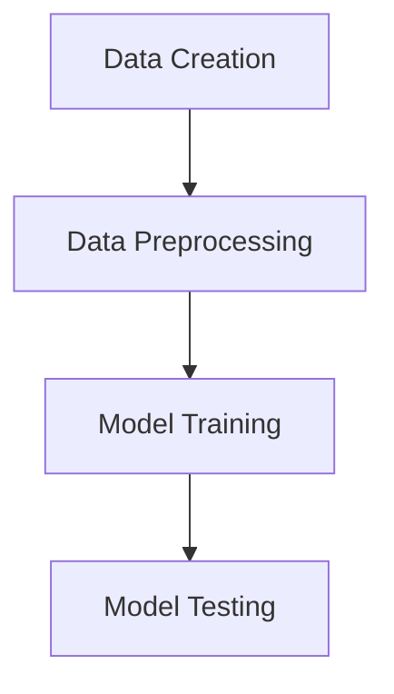

#
Это простая демонстрация конвейера машинного обучения.
Он создает тестовые и тренировочные данные погоды, затем их обрабатывает и обучает модель.

# Running the script 

bash pipeline.sh

# Pipeline Diagram
