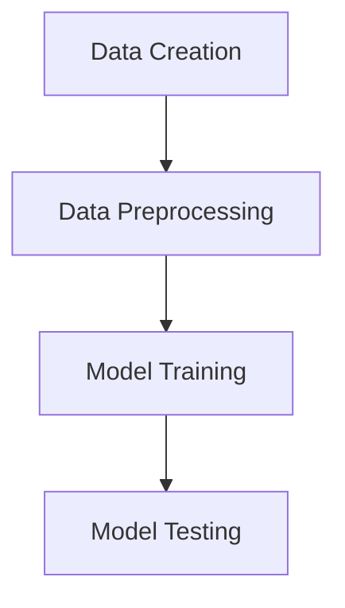

# Описание
Это простая демонстрация конвейера машинного обучения.
Он создает тестовые и тренировочные данные погоды, затем их обрабатывает и обучает модель.

# Запуск скрипта

bash pipeline.sh

# Pipeline 
